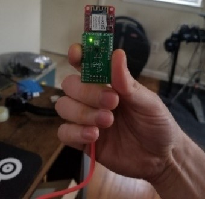
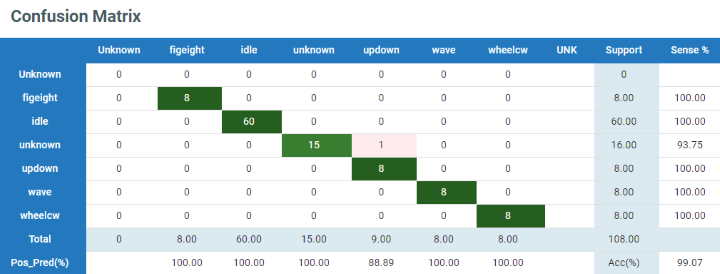

# Gesture Recognition with SensiML

<em>Deployed gesture recognizer</em>

## Overview
This repository is a companion to the [Gesture Recognition with SensiML
tutorial](https://microchipdeveloper.com/machine-learning:gesturerecognition-with-sensiml)
on the Microchip Developer website. It contains the firmware to classify a few different motion gestures on a SAMD21 Machine Learning Kit with the [Bosch BMI160
IMU](https://www.microchip.com/developmenttools/ProductDetails/EV45Y33A)
([Mikroe IMU2 click board](https://www.mikroe.com/6dof-imu-2-click)) or with the
[TDK ICM42688
IMU](https://www.microchip.com/DevelopmentTools/ProductDetails/PartNO/EV18H79A)
([Mikroe IMU14 click board](https://www.mikroe.com/6dof-imu-14-click)).

The supported gestures (shown in the video above) are:

- *Figure Eight*
- *Up-down*
- *Wave*
- *Wheel*

In addition there is also an 'unknown' class for gesture-like movement and an 'idle' class for low motion activity.

## Continuous Gestures Dataset

The dataset used for this project can be downloaded from the [releases page](../../releases) - it includes a collection of 10 second long samples in CSV format (ax,ay,az,gx,gy,gz format) split into training and test folds. A [DCLI](https://sensiml.com/documentation/data-capture-lab/importing-external-sensor-data.html#dcli-format-and-pre-labeled-data) descriptor file is also included for each fold for easy import into SensiML's [Data Capture Lab](https://sensiml.com/documentation/data-capture-lab/index.html).

The gestures dataset was collected by Microchip employees and consists of two test subjects performing the continuous gestures as described in the section above with a [SAMD21 BMI160 evaluation board](https://www.microchip.com/developmenttools/ProductDetails/EV45Y33A). Participants were directed to perform the gestures in a natural way, using a thumb and index finger grip around the SAMD21 board as shown in the image below, with the top of the board facing away from them, and the USB connector oriented towards the ground.

<em>Thumb and index finger grip</em>

In addition to the target gestures, some additional gestures - *triangle*, *forward wheel*, the letter *V*, and others - were collected to make up the *unknown* gestures class, which is used to help improve and validate the models discriminatory ability.

Furthermore, the *idle* class data consists of scenarios where the device is fully at rest in different orientations, and other scenarios with small motion activity that included fidgeting with the board (manipulating the board randomly with the fingers) and pacing around the room while holding the board.

## Sensor Configuration
The firmware used in the data collection can be downloaded from the [releases page](../../releases).

Sensor configuration values used in the data collection are summarized in the table below. Note that only accelerometer data was used in training the classifier.

| IMU Sensor | Axes | Sampling Rate | Accelerometer Range | Gyrometer Range |
| --- | --- | --- | --- | --- |
| Bosch [BMI160](https://www.bosch-sensortec.com/products/motion-sensors/imus/bmi160/) | Ax, Ay, Az, Gx, Gy, Gz | 100Hz | 16G | 2000DPS |

## Benchmarks
Measured with the BMI160 sensor configuration, ``-O2`` level compiler optimizations, and 48MHz clock
- 39.4kB Flash
- 5.6kB RAM
- 9ms Inference time

## Classifier Performance
Below is the confusion matrix for the test dataset. Note that the classes are highly imbalanced so accuracy is not a good indicator of overall performance.

<em>Test set confusion matrix</em>

