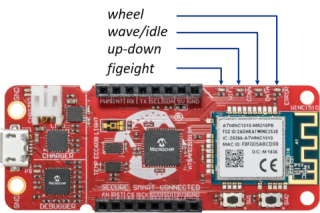

# Gesture Recognition with SensiML
|  |
| :--: |
| Deployed gesture recognizer |

## Overview
This repository is a companion to the [Gesture Recognition with SensiML
tutorial](https://microchipdeveloper.com/machine-learning:gesturerecognition-with-sensiml)
on the Microchip Developer website. It contains the firmware to classify a few different motion gestures on a SAMD21 Machine Learning Kit with the [Bosch BMI160
IMU](https://www.microchip.com/developmenttools/ProductDetails/EV45Y33A)
([Mikroe IMU2 click board](https://www.mikroe.com/6dof-imu-2-click)) or with the
[TDK ICM42688
IMU](https://www.microchip.com/DevelopmentTools/ProductDetails/PartNO/EV18H79A)
([Mikroe IMU14 click board](https://www.mikroe.com/6dof-imu-14-click)).

The supported gestures (shown in the video above) are:

- *Figure Eight*
- *Up-down*
- *Wave*
- *Wheel*

In addition there is also an 'unknown' class for gesture-like movement and an 'idle' class for low motion activity.

## Performing Gestures
Gestures should be performed in a way that feels natural, using a thumb and index finger grip around the SAMD21 board as shown in the image below. The top of the board should be facing away from the user, with the USB connector oriented towards the ground.

|  |
| :--: |
| Thumb and index finger grip |

The supported gestures are listed below (described from user's point of view):

- Figure Eight - Move the board in a figure eight pattern, starting the gesture from the top of the eight and going left (counterclockwise) at a slow to moderate speed
- Up-down - Move board up and down continuously at a moderate speed
- Wave - Wave the board side to side at a moderate speed as if you were greeting someone
- Wheel - Move the board in a clockwise circle (or wheel) continuously, at a moderate speed

Also see the GIF at the top of this document for further reference.

## Firmware Operation
The firmware can be thought of as running in one of five states as reflected by the onboard LEDs and described in the table below:

| State |	LED Behavior |	Description |
| --- | --- | --- |
| Error |	Red (ERROR) LED lit |	Fatal error. (Do you have the correct sensor plugged in?). |
| Buffer Overflow |	Yellow (DATA) and Red (ERROR) LED lit for 5 seconds	| Processing is not able to keep up with real-time; data buffer has been reset. |
| Idle | Yellow (DATA) LED lit |	Board is in idle state. |
| Unknown Gesture |	No LEDs lit	| Gesture-like motion detected, but not a known gesture. |
| Recognized Gesture | Single LED flashing according to gesture class |	One of the known gestures has been detected. |

When a gesture is recognized by the firmware, one of the onboard LEDs will begin flashing quickly according to the gesture class; this mapping is shown in the image below.

|  |
| :--: |
| Gesture class to LED mapping |

In addition, the firmware also prints the classification output for each inference over the UART port. To read the UART port use a terminal emulator of your choice (e.g., MPLAB Data Visualizer's integrated terminal tool) with the following settings:

- Baudrate 115200
- Data bits 8
- Stop bits 1
- Parity None

A sample of the terminal output is shown in the figure below.

|  |
| :--: |
| UART Terminal Output |

## Continuous Gestures Dataset

The gestures dataset was collected by Microchip employees and consists of two test subjects performing the continuous gestures as described in the section above with a [SAMD21 BMI160 evaluation board](https://www.microchip.com/developmenttools/ProductDetails/EV45Y33A). The dataset can be downloaded from the [releases page](../../releases) - it includes a collection of 10 second long samples in CSV format (ax,ay,az,gx,gy,gz format) split into training and test folds. CSV files are named according to the following template:

``<class>-<participant-id>-<extra-metadata>-<collection-date-yymmdd>-<sample-number>.csv``

A [DCLI](https://sensiml.com/documentation/data-capture-lab/importing-external-sensor-data.html#dcli-format-and-pre-labeled-data) descriptor file is also included for each fold for easy import into SensiML's [Data Capture Lab](https://sensiml.com/documentation/data-capture-lab/index.html).

In addition to the target gestures, some additional gestures - *triangle*, *forward wheel*, the letter *V*, and others - were collected to make up the *unknown* gestures class, which is used to help improve and validate the models discriminatory ability.

Furthermore, the *idle* class data consists of scenarios where the device is fully at rest in different orientations, and other scenarios with small motion activity that included fidgeting with the board (manipulating the board randomly with the fingers) and pacing around the room while holding the board.

## Sensor Configuration
Binary builds of the data logging firmware used in the data collection for this project can be downloaded from the [releases page](../../releases); see the [ml-samd21-iot-imu-data-logger](https://github.com/MicrochipTech/ml-samd21-iot-imu-data-logger) repository to build data logging firmware with different sensor configurations.

Sensor configuration values used in the data collection are summarized in the table below. Note that only accelerometer data was used in training the classifier.

| IMU Sensor | Axes | Sampling Rate | Accelerometer Range | Gyrometer Range |
| --- | --- | --- | --- | --- |
| Bosch [BMI160](https://www.bosch-sensortec.com/products/motion-sensors/imus/bmi160/) | Ax, Ay, Az, Gx, Gy, Gz | 100Hz | 16G | 2000DPS |

## Firmware Benchmark
Measured with the BMI160 sensor configuration, ``-O2`` level compiler optimizations, and 48MHz clock
- 39.4kB Flash
- 5.6kB RAM
- 9ms Inference time

## Classifier Performance
Below is the confusion matrix for the test dataset. Note that the classes are highly imbalanced so accuracy is not a good indicator of overall performance.

